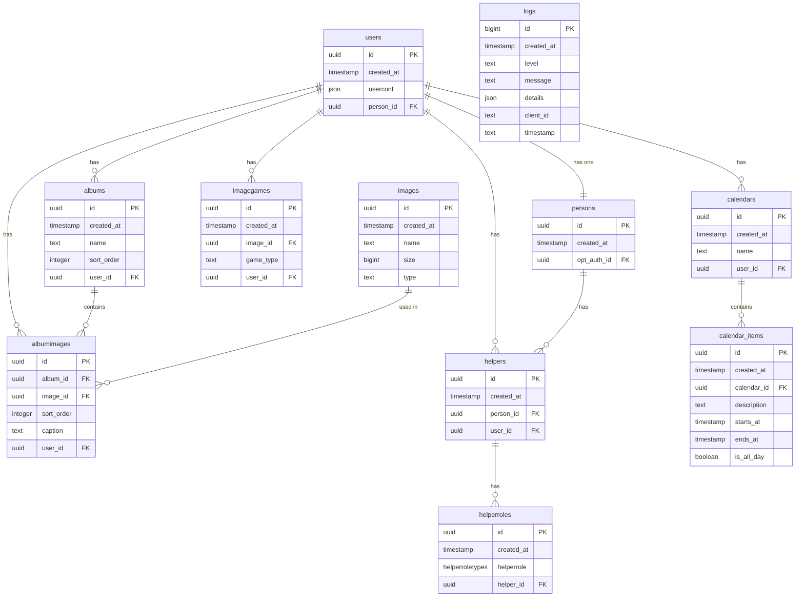

# goodtimes-supabase
Repo for handling database, migrations, etc

## Normal operations - techniques

### Start and stop local Supabase server

Start the local Supabase server. The normal Supabase interface is typically accessed at http://localhost:54323

```bash
npx supabase start
``` 

Stop the local Supabase server

```bash
npx supabase stop
```

### Resetting local database to what is in local migrations

```bash
npx supabase db reset
```

### Detect changes and create migrations

Create a new empty migration file 

```bash
npx supabase migration new
```

Create a new migration file with any detected changes to the local database included

```bash 
npx supabase db diff | npx supabase migration new name_of_new_migration
```

Run local migrations that have not yet been run. 

```bash
npx supabase migration up
```

## Handling a database change

1. Make sure you are running locally (see below) and have the latest local migrations from the repo
2. Understand the current state of the local database and remote database  migration status by running `npx supabase migration list`
3. Run the local migrations up to the latest `npx supabase migration up`
4. Make sure the local database is in sync with the remote database by running `npx supabase db diff --linked` and `npx supabase migration list`. If any problems, resolve them before continuing.
4. Make the changes to the database schema - typically in supabase studio (but it could also be done in a migration file created by hand and run, which then covers 5. and 6.)
5. Create a new migration file with any detected changes to the local database included `npx supabase db diff | npx supabase migration new name_of_new_migration`
6. Run the local migrations up to the latest `npx supabase migration up` (only if you have written the migration file by hand)
7. Reset the local database to the latest database schema `npx supabase db reset`
8. Think very carefully about the implications of the changes you have made in terms of which versions of the PWA the users will experience while the system (DB + code) moves to the final new version of both the DB and the code.
9. Adapt application logic, if needed, in the main app repo 
10. Simultaneously push the changes to the remote database (`npx supabase db push`) and push the corresponding app changes to the main app repo and do appropriate deployment.


## Setting up the local environment

See https://supabase.com/docs/guides/local-development

1. Install Supabase CLI

```bash
npm install -g supabase
```

2. Initialize the project

```bash
npx supabase init
```

3. Install Docker Desktop (on Windows). On Mac, ....

4. Start the local Supabase server

```bash
npx supabase start
```

5. View the local Supabase Studio on  http://localhost:54323

6. Link local installation to remote Supabase project

First login

```bash
npx supabase link
```

Then link the local project to the remote project

```bash
npx supabase link --project-ref dlpldhwoanpxumzendmg
```

7. Get remote schema

```bash
npx supabase db pull
```

8. Run migrations fromm pull to freshly reset local database that is then built from scratch

```bash
npx supabase db reset
```
Now the local database is reset and the remote schema is pulled in.

9. To verify that the local database is in sync with the remote database, you can use the following command:

```bash
npx supabase db diff --linked
```

10. To see the migrations run locally and remotely, you can use the following command:

```bash
npx supabase migration list
```

## Current schema

The schema is defined in `current_schema.sql` which is generated by `npx supabase db dump --local > current_schema.sql`. Then Cursor is asked `can you create a nice markdown version of this database schema - maybe using mermaid` - which produces the below.




